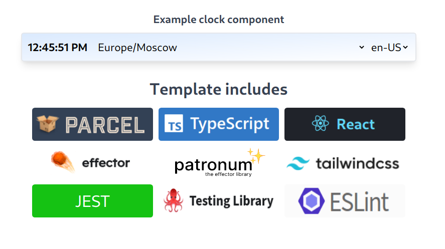
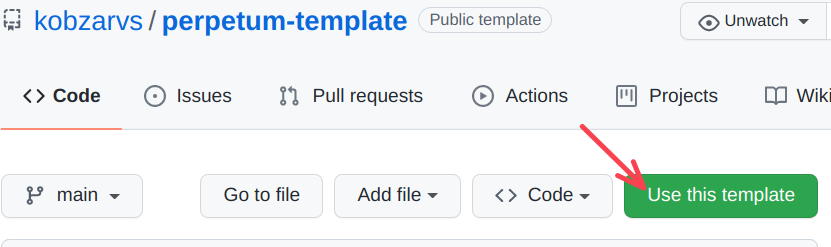

# perpetum-template

## Template includes

- [`P`arcel](https://parceljs.org/)
- [`E`ffector](https://effector.dev/)
- [`R`eact](https://ru.reactjs.org/)
- [`P`atronum](https://github.com/effector/patronum)
- [`E`SList](https://eslint.org/)
- [`T`ailwindcss](https://tailwindcss.com/)
- [Patron`um`](https://github.com/effector/patronum)
- [TypeScript](https://www.typescriptlang.org/)
- [JEST](https://jestjs.io/ru/)
- [testing-library](https://testing-library.com/)



## Getting started

### Prerequisite

- node >= ^12.x.x (^16.x.x recommended)
- npm latest
- yarn latest

### Install && run



```shell
cd <you-folder>
yarn install
yarn start
```

### Testing

```shell
yarn lint
yarn test
```

### Clean and build

```shell
yarn clean && yarn build
```

### Project files structure

```text
.
├── images
│
├── public
│   └── index.html
│
├── src
│   ├── components
│   │   └── app
│   │
│   ├── features
│   │   └── clock (for example can be removed)
│   │       ├── components
│   │       │   └── __tests__
│   │       └── model
│   │           └── __tests__
│   │
│   ├── lib (helpers)
│   │   └── testing-helpers.ts
│   │
│   ├── models
│   ├── index.css
│   └── index.tsx
│
├── static (files for using without import in .ts|.tsx)
│   └── images
│
├── README.md
├── jest.config.js
├── package.json
├── package-lock.json
├── tailwind.config.js
├── tsconfig.json
└── yarn.lock
```
